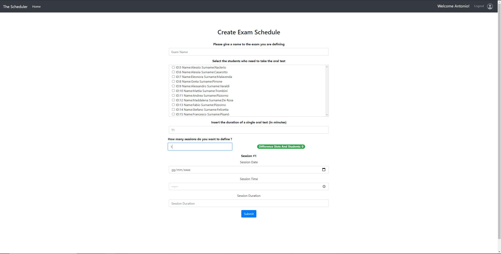

# Exam #3: "Scheduling Oral Tests"
## Student: s276624 Pizzorno Alessandro 

## React client application routes

- Route `/`: Initial page you are presented with, it is used to let the user choose wether he wants to log in to acces teachers functionalities or if he wants to access the student ones by specifying simply his Student ID.

- Route `/login`: It is the log in page containing the login form to use for teachers to provide their credentials and log in in order to access their specific functionalities.

- Route `/students/:student`: It is the page for a specific student to access his/her own functionalities. The student param is the Student ID provided.

- Route `/teachers/:teacher`: It is the page for a specific teacher to access his/her own functionalities. The teacher param is the Teacher ID in the database table.

- Route `/teachers/:teacher/addexam`: It is the page used by a specific teacher to create a new exam schedule. The teacher param is the Teacher ID in the database table.

## REST API server

- POST `/api/login`
  - There are no request parameters, but the request body content is an object containing the user's username (e-mail) and password.
  - The response body content is an object containing the user's ID (Tecaher ID) and name. Incase of error the content of the response is an object containing the error. The response carries the jwt token as an http cookie as well.

- POST `/api/logout`
  - The jwt token stored in the http cookie is cleared.

- GET `/api/students/:student`
  - The request parameter :student is the Student ID
  - The response body content is the Student object corresponding to the provided ID.

- GET `/api/students/:student/exams`
  - The request parameter :student is the Student ID
  - The response body content is an array of Exam objects of the Student corresponding to the provided ID.

- GET `/api/students/:student/teachers`
  - The request parameter :student is the Student ID
  - The response body content is an array of Teacher objects of the Student corresponding to the provided ID.

- GET `/api/students/:student/slots`
  - The request parameter :student is the Student ID
  - The response body content is an array of Slot objects of the Student corresponding to the provided ID.

- GET `/api/teachers/:teacher/slots`
  - The request parameter :teacher is the Teacher ID
  - The response body content is an array of Slot objects representing all the      slots of all the exams defined by that sepcific teacher.

- PUT `/api/teachers/:teacher/exams/:exam/slots/:student`
  - The request parameters are: :student for the Student ID, :teacher for the Teacher ID and :exam for the Exam ID. The request body content is the Slot object the specific student wants to book or unbook with the Student ID property set to the one of the student. This is the only field of the slot the student will be ale to modify
  - There is no response body content unless an error verifies, in that case the body contains an object representing th error tha occurred.

#### From now on the rest of the APIs are authenticated so we can exploit the jwttoken carried by the http cookie to retrieve the specific user ID (Teacher ID).

- GET `/api/teacher`
  - The are no request parameters. 
  - The response body content is an object containing the ID (Teacher ID) of the specific teacher and his/her name.

- GET `/api/teachers/:teacher/exams`
  - The request parameter :teacher is the ID of the specific teacher. 
  - The response body content is an array of Exam objects corresponding to all the exams defined by that teacher.

- GET `/api/teachers/:teacher/students`
  - The request parameter :teacher is the ID of the specific teacher. 
  - The response body content is an array of Student objects corresponding to all the students of that teacher.

- GET `/api/teachers/:teacher/exams/:exam/students`
  - The request parameter :teacher is the ID of the specific teacher, :exam is the ID of the specific exam defined by that teacher. 
  - The response body content is an array of Student objects corresponding to all the student selected by that teacher for that specific exam.

- PUT `/api/teachers/:teacher/exams/:exam/slots`
  - The request parameter :teacher is the ID of the specific teacher, :exam is the ID of the specific exam defined by that teacher. The request body content is a Slot object containing the already modified by the teacher slot of that specific exam. This allows teacher to evaluate an oral test taken by a student. The teacher will only be able to modify the mark, present and whitdrawn fields of the slot.
  - There is no response body content unless an error verifies, in that case the body contains an object representing the error that occurred.

- POST `/api/teachers/:teacher/exams/:exam/students/:student`
  - The request parameter :teacher is the ID of the specific teacher, :exam is the ID of the specific exam defined by that teacher and :student is the ID of a specific student of that teacher. The request body is an Exam object corresponding to the exam for which the teacher wants to select the student.
  - There is no response body content unless an error verifies, in that case the body contains an object representing the error that occurred.

- POST `/api/teachers/:teacher/exams`
  - The request parameter :teacher is the ID of the specific teacher. The request body is an Exam object corresponding to the new exam defined by the teacher except the Exam ID.
  - There response body content is an object conmtaining the Exam ID of the newly inserted exam, unless an error occurs, in that case the body contains an object representing the error.

- POST `/api/teachers/:teacher/exams/:exam/slots`
  - The request parameter :teacher is the ID of the specific teacher, :exam is the ID of the specific exam defined by that teacher. The request body is a Slot object corresponding to the new slot the teacher wants to define for that exam.
  - There is no response body content unless an error verifies, in that case the body contains an object representing the error that occurred.

## Server database

- Table `Students` - contains all of the students. The attributes of the table are: SID (Student ID), Name, Surname.

- Table `Teachers` - contains all of the teachers. The attributes of the table are: TID (Teacher ID), Email, CourseCode, CourseName, Name, Surname, Hash (hash of the teacher's password).

- Table `Exams` - contains all of the exams defined by the various teachers. The attributes of the table are: EID (Exam ID), Exam_Name, TID (Tecaher ID).

- Table `Slots` - contains all of the slots defined by the various teachers for the various exams. The attributes of the table are: TID (Teacher ID), Day, Starting_Time, Duration, SID (Student ID), Mark, Present, Whitdrawn, EID (Exam ID), OralTaken.

- Table `Enrollments` - It is used to manage the many to many relationship with students and teachers representing the enrollment of a student to a teacher's course. The attributes of the table are: SID (Student ID) and TID (Teacher ID).

- Table `Assignements` - It is used to manage the many to many relationship representing the selection of the students for a specific exam done by a teacher. The attributes of the table are: SID (Student ID), TID (Teacher ID), EID (Exam ID).

## Main React Components

- `StudentMenu` (in `StudentMenu.js`): It represents the page a specifc student accesses after having provided his ID if it is valid and it allows a specific student to see the various exam for which he/she has been selected, to book or unbook for a specific slot of an exam and also to see the mark he was assigned after an oral test taken on a specific slot.

- `TeacherMenu` (in `TeacherMenu.js`): It represents the page to which a teacher is redirected after having logged in and it allows the specific teacher to see an overview of the exams he has defined with a list of the students selected for a specific exam and their current situation. If a student has booked a slot a teacher can execute his oral test from this page. This component also manages the routing to the page to create a new exam for that teacher.

- `SchedulerList` (in `SchedulerList.js`): It's a generalized version of the ListGroup component offered by react bootstrap and it is used to create the different lists visualized in the pages previously mentioned.

- `SchedulerItem` (in `SchedulerItem.js`): It's a generalized version of the ListGroup.Item component offered by react bootstrap and it is used to create the different items of the lists previously mentioned.

- `NavigationBar` (in `NavigationBar.js`): It is the NavBar for the website. It allows teachers to acces the log in page and to also log out and in general it allows users to go back to their respective homepage.

- `LoginForm` (in `LoginForm.js`): It represents the login form used by teachers to authenticate contained in the login page. It preforms form validation too.

- `CreateExamScheduleForm` (in `CreateExamScheduleForm.js`): It represents the form used by teachers in the addexam page to define and create new exam schedules with their list of selected students and slots. It preforms form validation too.

- `OralTestResultForm` (in `OralTestResultForm.js`): It represents the form used by teachers to evaluate an oral test taken by a student on a specific slot of an exam. It preforms form validation too. 

- `SessionFormGroup` (in `SessionFormGroup.js`): It is a custom component used just to group the three different elements representing a new session of the form used to add a new exam. It preforms form validation too.

- `StudentIDForm` (in `StudentIDForm.js`): It represents the form used by a student on the initial page of the site to provide his/her ID in order to access his/her personal functionalities. It preforms form validation too.

## Screenshot

Screenshot of the page for adding a new exam schedule, the slots are then calculated from the sessions defined using the base slot duration T1 provided also in the form.

## Test users

* fulvio.corno@gmail.com, password
* antonio.lioy@gmail.com, verysecurepassword

#### For students here are the different IDs to use:

You can use the as IDs simply the numbers from 1 to 15 extremes included. The ID casn be provided as it is or with an s or S at the beginning.
The students from 1 to 10 are enrolled in the course of the first teacher.
The students from 5 to 15 are enrolled in the course of the second teacher.

